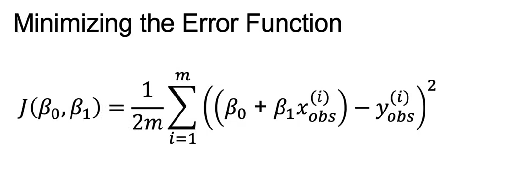

# 1. Introduction to Supervised Machine Learning  
# Supervised Learning 

**Parameters (tham số):** được học từ dữ liệu (ví dụ: hệ số hồi quy).  

**Hyperparameters (siêu tham số):** được chọn trước khi huấn luyện, quy định cấu hình mô hình (ví dụ: số cây trong Random Forest, learning rate).  


---

## Hai loại bài toán supervised learning:

- **Regression:** dự đoán giá trị số (stock price, doanh thu phim, tọa độ).  
- **Classification:** dự đoán nhãn phân loại (nhận diện khuôn mặt, churn khách hàng, dự đoán từ tiếp theo).  


---

## Cơ chế học:

- Input **X** → mô hình với tham số **Ω** → output dự đoán **ŷ**  
- Huấn luyện bằng dữ liệu quá khứ để tìm tham số tối ưu.  
- Sử dụng **train/test split** để tránh overfitting và đảm bảo khả năng **generalization**.  


---

## Loss function:

- **J(y, ŷ):** đo mức sai khác giữa giá trị dự đoán và thực tế.  
- Mô hình tối ưu tham số để **minimize loss**.  

# 2. Linear Regression (Hồi quy tuyến tính)

## Mục tiêu
Dự đoán biến liên tục (ví dụ: doanh thu phim dựa trên ngân sách marketing).

## Mô hình
$$
\hat{y} = \beta_0 + \beta_1 X
$$

- **$\beta_0$**: intercept — giá trị dự đoán khi $X=0$.  
- **$\beta_1$**: slope — mức tăng doanh thu khi tăng 1 đơn vị ngân sách.


## Ví dụ
- $\beta_0 = 80$ triệu → nếu ngân sách = 0 thì doanh thu dự đoán = 80 triệu.  
- $\beta_1 = 0.6$ → mỗi 1 đô marketing thì doanh thu tăng 0.6 đô.  
- Nếu ngân sách = 160 triệu → doanh thu ≈ $80 + 0.6 \times 160 = 176$ triệu.


## Cách tìm đường thẳng tối ưu
1. So sánh giá trị dự đoán với giá trị thực tế → tính **sai số (error)**.  
2. Sai số có thể âm/dương nên thường dùng:  
   - **L1 norm**: $|\hat{y} - y|$  
   - **L2 norm**: $(\hat{y} - y)^2$  


## Hàm mất mát phổ biến: Mean Squared Error (MSE)
$$
J(\beta_0, \beta_1) = \frac{1}{2m}\sum_{i=1}^{m} (\hat{y}_i - y_i)^2
$$

→ Bài toán: tìm $\beta_0, \beta_1$ để **minimize MSE**.




# 3. Linear Regression – Best Practices & Evaluation

## Best Practices khi Modeling
1. **Xác định hàm mất mát (cost function)** cần minimize → tiêu chí so sánh mô hình.  
2. **Thử nhiều mô hình / hyperparameters** khác nhau.  
3. **So sánh kết quả** và chọn mô hình tốt nhất dựa trên cost function.  

---

## Đánh giá mô hình

### Mean Squared Error (MSE)
Đo sai số trung bình bình phương giữa giá trị dự đoán và giá trị thực tế.  

$$
MSE = \frac{1}{m}\sum_{i=1}^{m}(\hat{y}_i - y_i)^2
$$

### R-squared (R²)
Đo lường tỉ lệ phương sai được giải thích bởi mô hình.  

$$
R^2 = 1 - \frac{SSE}{TSE}
$$

- **SSE (Sum Squared Error):** phần sai số chưa giải thích.  
- **TSE (Total Squared Error):** tổng biến thiên quanh giá trị trung bình.  
- R² càng gần **1** → mô hình càng giải thích tốt dữ liệu.  

---

## Lưu ý
- Thêm biến (feature) **không bao giờ làm giảm R²**, kể cả khi biến đó không có ý nghĩa.  
- R² có thể dùng cho **bất kỳ mô hình hồi quy**, không chỉ linear regression.  

---

## Triển khai trong Python (sklearn)

```python
from sklearn.linear_model import LinearRegression

# Khởi tạo model
LR = LinearRegression()

# Huấn luyện mô hình
LR.fit(X_train, y_train)

# Dự đoán trên tập test
y_pred = LR.predict(X_test)
