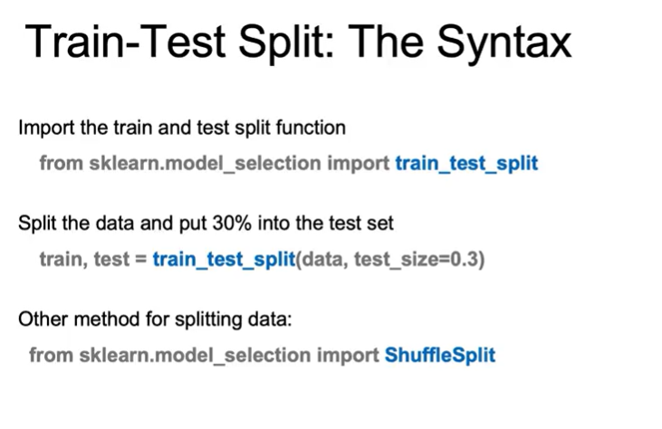

# 1. Train/Test Split & Cross-Validation

## Mục tiêu
Đánh giá mô hình trên dữ liệu chưa từng thấy → đảm bảo **khả năng tổng quát (generalization)**.

---

## Train/Test Split
- **Training set**: dùng để huấn luyện, tìm tham số tối ưu.  
- **Test set**: giữ lại, không tham gia huấn luyện → kiểm tra mô hình trên dữ liệu “unseen”.  
- **Tránh data leakage**: dữ liệu train và test phải **độc lập**.  

---

## Cross-Validation
- Chia dữ liệu thành nhiều phần → lần lượt dùng các phần làm test.  
- Giúp ước lượng tốt hơn hiệu năng thực tế của mô hình.  

---

## Model Complexity vs. Error
- Mô hình quá đơn giản → **underfitting**.  
- Mô hình quá phức tạp → có thể đạt 100% accuracy trên train nhưng **overfitting**, kém trên test.  
- Cần **cân bằng độ phức tạp** để đạt sai số thấp trên cả train và test.  

---

## Khái niệm
- **Training data (X_train, y_train)**: dùng để huấn luyện mô hình, tìm tham số (fit).  
- **Test data (X_test, y_test)**: đưa `X_test` vào mô hình đã học để dự đoán → so sánh với `y_test` thật → tính **test error**.  

## Syntax

# 2. Addition of Polynomial Features
## Polynomial Features

- Tạo đặc trưng mới từ đặc trưng gốc (bình phương, lập phương, tích giữa các biến).

- Mặc dù mô hình thêm biến phi tuyến, bản chất vẫn là linear regression (tổ hợp tuyến tính của các đặc trưng đã biến đổi).

- Giúp mô hình bắt được quan hệ cong/phi tuyến.

## Syntax
