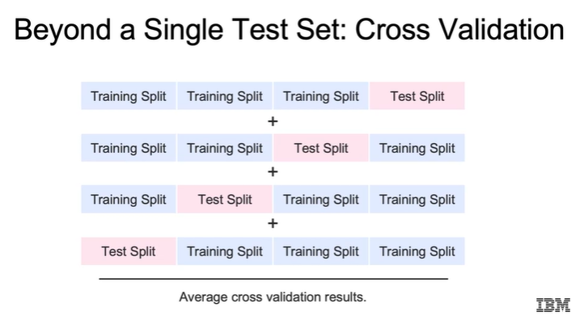
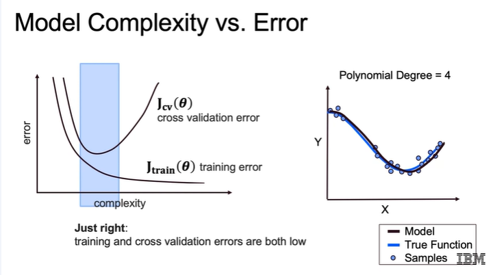

# Cross-Validation 

## Ý tưởng chính
- Train/Test split 1 lần có thể “may mắn” → kết quả thiếu tin cậy.  
- Cross-validation = chia dữ liệu thành nhiều phần → huấn luyện & đánh giá nhiều lần → lấy trung bình lỗi.  
- Kết quả ổn định & đáng tin cậy hơn.  

## Quy trình
1. Chia dữ liệu thành K phần (folds).  
2. Lặp K lần: chọn 1 phần làm validation, K-1 phần làm train.  
3. Tính error mỗi lần → lấy trung bình error.  

## Các biến thể
- **K-Fold**: phổ biến nhất, K thường = 5 hoặc 10.  
- **Leave-One-Out (LOO)**: K = số hàng dữ liệu (mỗi lần bỏ 1 mẫu ra làm test). Rất chính xác nhưng tốn thời gian.  
- **Stratified K-Fold**: đảm bảo tỷ lệ nhãn (class distribution) giống nhau trong các tập train/test.  

## Mối quan hệ Model Complexity vs Error
- Độ phức tạp ↑ → train error ↓ nhưng validation error sẽ có **điểm uốn (inflection point)**.  
- Quá đơn giản → **underfitting** (train/test error cao).  
- Quá phức tạp → **overfitting** (train error thấp nhưng test error cao).  
- **Mục tiêu:** “Goldilocks point” → train error thấp, validation error cũng thấp.  

## Syntax

Thư viện **Scikit-Learn** cung cấp nhiều phương thức để chia dữ liệu thành **training, testing và validation sets**.  
Một số phương thức phổ biến:

- **train_test_split**  
  Tạo một lần chia dữ liệu thành tập train và test.

- **K-Fold**  
  Tạo ra K lần chia dữ liệu, cho phép thực hiện cross-validation.

- **cross_val_score**  
  Đánh giá điểm số (score) của mô hình thông qua cross-validation.

- **cross_val_predict**  
  Tạo ra dự đoán (prediction) ngoài mẫu (out-of-bag) cho từng hàng dữ liệu.

- **GridSearchCV**  
  Quét qua các tham số để chọn tập **siêu tham số (hyperparameter)** tối ưu, đạt điểm số ngoài mẫu (out-of-sample score) cao nhất.
