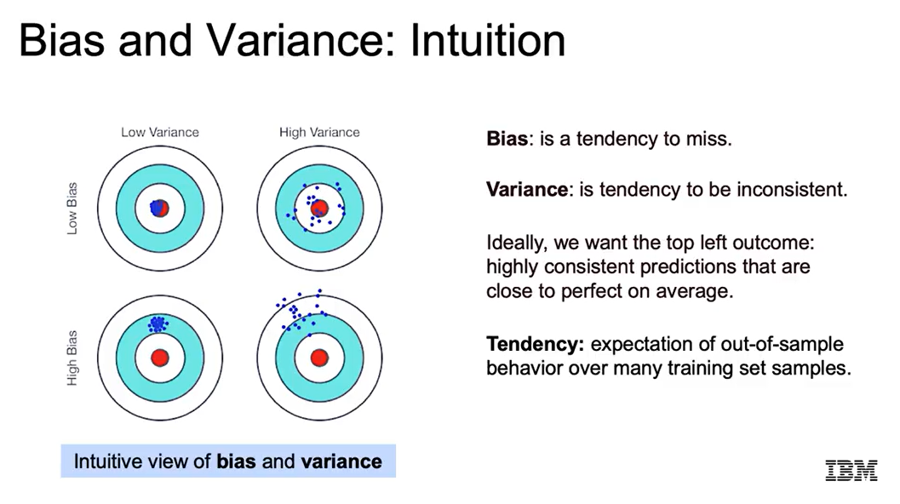
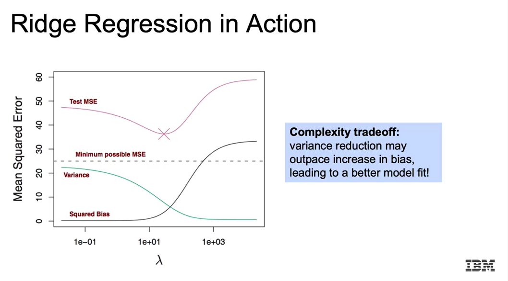
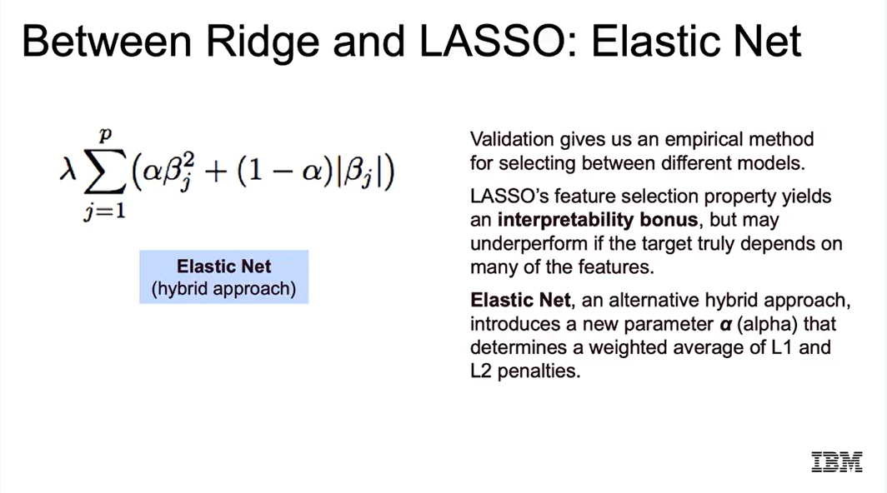

# 1. Bias–Variance Tradeoff 

## Ý tưởng chính
- **Độ phức tạp mô hình ↔ Lỗi**  
  - Quá đơn giản → **Underfitting** (train/test error đều cao).  
  - Quá phức tạp → **Overfitting** (train error thấp, test error cao).  
  - Mục tiêu: mức “vừa đủ” (Goldilocks point).  

## Bias vs Variance
- **Bias (độ chệch)**:  
  - Xu hướng dự đoán **sai lệch theo một hướng cố định**.  
  - Thường do mô hình quá đơn giản.  
  - Liên quan đến **Underfitting**.  

- **Variance (phương sai)**:  
  - Xu hướng dự đoán **dao động mạnh, thiếu ổn định**.  
  - Mô hình quá nhạy với dữ liệu (quá phức tạp).  
  - Liên quan đến **Overfitting**.  

- **Random noise (nhiễu ngẫu nhiên)**:  
  - Sai số vốn có trong dữ liệu thực.  
  - Không thể loại bỏ hoàn toàn.  

## Nguồn gốc lỗi
1. **Bias cao** → mô hình bỏ qua cấu trúc thực (thiếu thông tin, quá đơn giản).  
2. **Variance cao** → mô hình học cả nhiễu (quá phức tạp, không ổn định).  
3. **Noise** → sai số ngẫu nhiên, không thể tránh.  

## Tradeoff
- **Tăng độ phức tạp** → Bias ↓ nhưng Variance ↑.  
- **Giảm độ phức tạp** → Variance ↓ nhưng Bias ↑.  
- **Mục tiêu**: cân bằng Bias và Variance để có **lỗi tổng thể thấp nhất**.  

# 2. Ridge Regression 

## Ý tưởng chính
- Cost function = **Residual Sum of Squares (RSS)** + λ Σ β²  
- Thêm **penalty** (phụ thuộc vào bình phương hệ số) → làm nhỏ các hệ số → giảm độ phức tạp.  
- **Bias tăng**, **Variance giảm** → giúp tránh overfitting.  

## Đặc điểm
- Hệ số lớn bị phạt nặng (do bình phương).  
- Hệ số bị “shrink” về gần 0 nhưng **không bằng 0** (khác với Lasso).  
- Cần **chuẩn hoá dữ liệu** (standardization) vì thang đo ảnh hưởng mạnh đến penalty.  

## Vai trò của λ
- λ = 0: tương đương hồi quy tuyến tính thường.  
- λ lớn: hệ số bị co nhỏ, bias cao, mô hình đơn giản hơn.  
- Chọn λ tốt nhất bằng **cross-validation**.  

## Mối quan hệ
- λ ↑ → hệ số ↓.  
- Giúp giảm **variance**, kiểm soát overfitting.  
- Tìm “điểm cân bằng” (optimal λ) để sai số test thấp nhất.  

# 3. Recursive Feature Elimination (RFE)

##  Cách hoạt động
RFE sử dụng một mô hình (như **Linear Regression**, **Lasso**, hoặc **Random Forest**) có thuộc tính `coef_` hoặc `feature_importances_`.  
Quá trình diễn ra như sau:
1. Huấn luyện mô hình trên toàn bộ dữ liệu.
2. Đánh giá **độ quan trọng của từng đặc trưng**.
3. **Loại bỏ dần** các đặc trưng ít quan trọng nhất.
4. Lặp lại cho đến khi còn lại **số lượng đặc trưng mong muốn**.

---

##  Lưu ý
- **Chuẩn hóa dữ liệu** trước khi dùng các mô hình tuyến tính để các hệ số được so sánh trên cùng thang đo.

---

## Syntax

# 4. Elastic Net

##  Chọn mô hình

- Nếu ưu tiên **độ chính xác dự đoán**, dùng **validation** để chọn mô hình và siêu tham số tối ưu.  
- Nếu ưu tiên **giải thích**, **LASSO** có lợi thế vì loại bỏ các đặc trưng kém quan trọng.  
- Nếu ưu tiên **tốc độ tính toán**, **Ridge** nhanh và ổn định hơn.  

---

##  Elastic Net là gì?

**Elastic Net** kết hợp **L1 (LASSO)** và **L2 (Ridge)** trong cùng một **hàm chi phí**:

$$
\text{Cost} = \text{RSS} + \lambda \big[ \alpha \sum |w_i| + (1 - \alpha) \sum w_i^2 \big]
$$

- **λ (Lambda):** Điều chỉnh **mức phạt tổng thể** cho các hệ số lớn.  
- **α (Alpha):** Xác định **tỉ lệ giữa L1 và L2**:  
  - α → 1 → giống **LASSO** → loại bỏ đặc trưng không quan trọng.  
  - α → 0 → giống **Ridge** → giảm độ lớn hệ số mà không loại bỏ.  

---

##  Mục tiêu

**Elastic Net** tìm sự cân bằng giữa hai phương pháp:  
- Tận dụng ưu điểm của **Ridge** (ổn định, giảm overfitting).  
- Kết hợp khả năng **chọn đặc trưng** của **LASSO**.  

Kết quả là một mô hình **linh hoạt**, **tổng quát tốt hơn**, và **giảm nhược điểm** của từng phương pháp khi dùng riêng lẻ.

