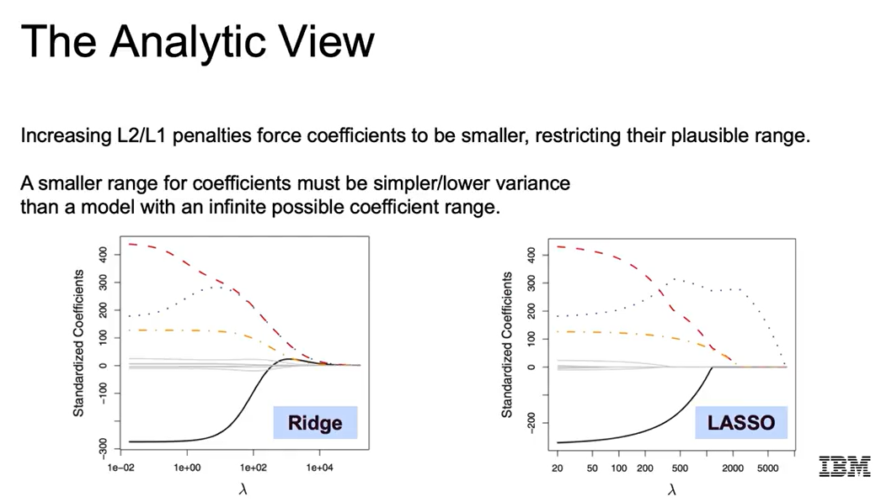
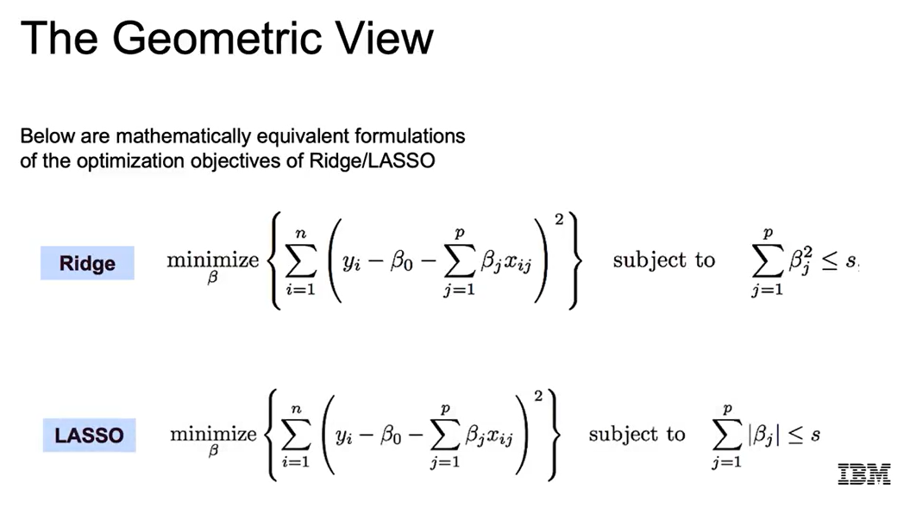
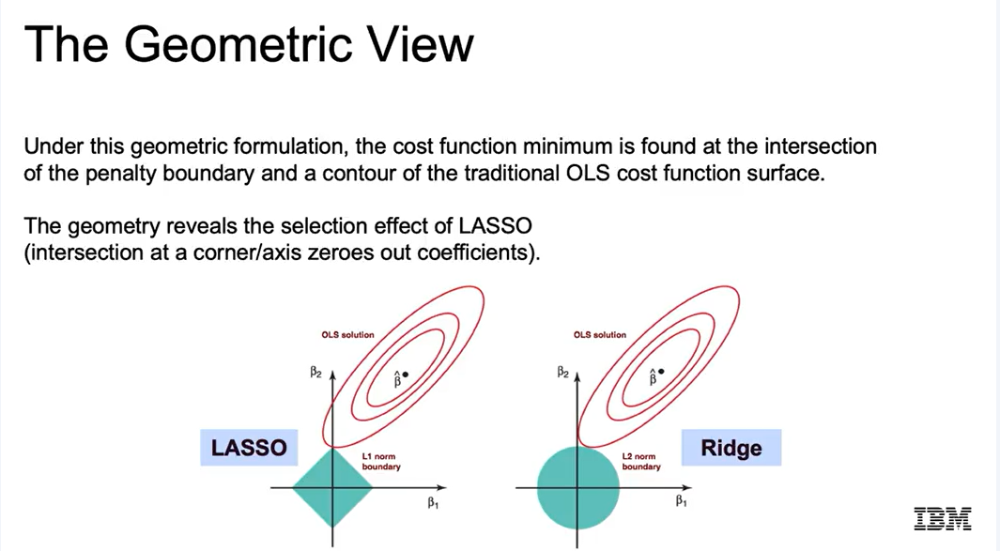

# Regularization

## 1. Phân tích (Analytical view)

- Khi thêm phạt **L1 (LASSO)** hoặc **L2 (Ridge)**, ta **ép các hệ số nhỏ lại** → mô hình đơn giản hơn, phương sai thấp hơn.  
- Hệ số càng nhỏ → đặc trưng đó càng ít ảnh hưởng đến biến mục tiêu \(y\).  
- Hệ số lớn → mô hình nhạy cảm với thay đổi → **variance cao**.  
- Khi loại bỏ đặc trưng (LASSO), **variance giảm mạnh hơn**.

---

## 2. Hình học (Geometric view)

- Mục tiêu là **tối thiểu hóa sai số OLS** nhưng **bị ràng buộc bởi hình dạng penalty**.  
- **Ridge:** ràng buộc `β₁² + β₂² ≤ S` → tạo **đường tròn**.  
- **LASSO:** ràng buộc `|β₁| + |β₂| ≤ S` → tạo **hình thoi (diamond)**.  
- **Điểm giao** giữa đường contour lỗi OLS (các đường cong đồng mức) và vùng ràng buộc là nghiệm tối ưu.  
  - Với **LASSO**, giao điểm thường nằm ở **góc nhọn của hình thoi** → **một hệ số = 0** → **feature selection**.  
  - Với **Ridge**, giao điểm nằm **trên đường tròn** → chỉ **co nhỏ hệ số**, không triệt tiêu hoàn toàn.

---

---

## 3. Xác suất (Probabilistic view)

Regularization có thể hiểu là **đặt phân phối tiên nghiệm (prior)** lên các hệ số hồi quy (*β*).

Khi ước lượng mô hình, ta **cập nhật posterior** của các hệ số dựa trên dữ liệu *X*, *Y*.

- **Ridge (L2):** giả định hệ số *β* được rút ra từ **phân phối chuẩn (Gaussian prior)**  
  → phạt bình phương → hệ số nhỏ dần nhưng không bằng 0.  
- **LASSO (L1):** giả định *β* được rút ra từ **phân phối Laplace (Laplacian prior)**  
  → có đỉnh nhọn tại 0 → nhiều hệ số bằng 0 (**feature selection**).  

**Tham số λ (lambda)** quyết định **độ hẹp của phân phối prior**:

- λ lớn → phương sai nhỏ → *β* có xu hướng gần 0 hơn.

---

## 4. Mục tiêu của Regularization

- **Cân bằng giữa bias và variance** để đạt **độ tổng quát (generalization)** cao.  
- **Thêm phạt vào hàm mất mát** → giảm độ phức tạp mô hình.  
- **Tăng bias nhưng giảm variance**, thường là **sự đánh đổi đáng giá**.

---

## 5. Kết luận

| Phương pháp | Đặc điểm chính | Ảnh hưởng |
|--------------|----------------|------------|
| **Ridge** | Co nhỏ hệ số (shrinkage) | Giảm variance, giữ tất cả đặc trưng |
| **LASSO** | Đưa hệ số về 0 (feature selection) | Giảm variance mạnh, tăng bias |
| **Elastic Net** | Kết hợp L1 và L2 | Cân bằng giữa ổn định và chọn lọc |

